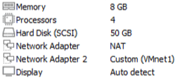
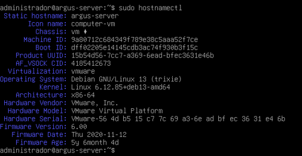
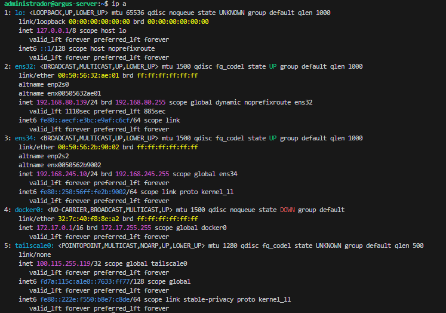
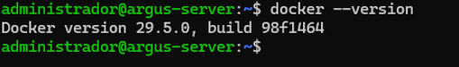

# ArgusNode OS

* **Argus Server:** El panel de control central (donde llega toda la información).
* **ArgusNode OS:** El pequeño software (agente) que instalas en cada máquina de la red para que recolecte los logs, el uso de CPU, RAM, etc.
* **Argus Eyes:** El sistema de alertas que te avisa cuando algo falla.

---

## Arquitectura detallada

### 1. El Inventario de Máquinas (Nodos)
* **Nodo Central (On-Premises):**
    * **1 Máquina Física o VM con Debian 13:** Es tu "Argus". Aquí corre Docker con el contenedor de ArgusNode OS. Debe tener visibilidad de tu red local y acceso a Internet.
* **Nodos Remotos (Azure Cloud):**
    * **1 VM Linux (Ubuntu Server):** Para monitorizar servicios web, uso de CPU y logs de SSH.
    * **1 VM Windows Server (Core o con GUI):** Fundamental para demostrar que tu app es multiplataforma (monitoreo de servicios de Windows, consumo de RAM).
    * **1 VM Linux (Ligera/Alpine):** Actuando como un "atacante" o generador de tráfico para probar tus alertas de red.

### 2. ¿Cómo logramos la "Modalidad Híbrida"?
**VPN Mesh (Tailscale o WireGuard):** Implementado en todas las máquinas. Esto crea una red privada virtual donde todas las máquinas (Azure y Debian) se ven como si estuvieran en el mismo switch local, con IPs privadas seguras.

### 3. Flujo de Datos (El "Sistema de Vigilancia")
Para que ArgusNode OS funcione, el planteamiento debe ser *Push*:
* **Agente Local:** En cada máquina de Azure, instalas un pequeño script (agente) que recolecta los datos.
* **Envío:** El agente envía un JSON cada 5 o 10 segundos hacia la API de tu contenedor en Debian a través de la VPN.
* **Acción Remota:** Para el encendido/apagado de Azure, tu app usará la Azure SDK (Python/JS) con una clave de API (Service Principal). Así, desde tu panel local, mandas una orden que viaja a la API de Microsoft y apaga la máquina.

### 4. Resumen de Stack Tecnológico
* **Orquestación:** Docker & Docker Compose.
* **Comunicación:** WireGuard (VPN) + HTTPS.
* **Backend:** Python (FastAPI) para gestionar las políticas y recibir métricas.
* **Gestión de Azure:** Azure CLI / SDK.

---

## DESGLOSE TÉCNICO DEL NODO CENTRAL: MÁQUINA ARGUS

El Nodo Central, bautizado como Argus, actúa como el cerebro orquestador de la infraestructura híbrida de observabilidad y cumplimiento. Su función principal es centralizar la ingesta de telemetría, procesar las políticas de control en tiempo real, servir la interfaz gráfica de administración y coordinar las acciones de automatización tanto locales como multicloud (vía API de Azure).

A continuación, se detallan los componentes de infraestructura, red y software que conforman este nodo.

### 1. Especificaciones del Sistema Operativo Base
* **Distribución:**
    * Debian GNU/Linux 13 (Trixie) - Rama Stable.
    * Memoria: 8 GB.
    * Procesador: 2 Núcleos, 2 Hilos.
    * Adaptadores: 2.
  
  

* **Tipo de Instalación:** Minimal (Netinstall), sin entorno gráfico (Headless Server).
  
  
* **Propósito de Seguridad (Hardening):** Al prescindir de un servidor X11/Wayland y entornos de escritorio (GNOME, KDE), se reduce drásticamente la superficie de ataque (superficie de exposición de vulnerabilidades) y se optimiza el consumo de recursos de computación. El sistema operativo en reposo consume aproximadamente ~150 MB - 200 MB de memoria RAM.
* **Servicios Base del Sistema:** Servidor OpenSSH (`sshd`) endurecido y utilidades del sistema estándar (`curl`, `wget`, `nano`).

### 2. Arquitectura de Red y Segmentación de Interfaces (Dual-NIC)
Para garantizar la resiliencia en la conectividad del centro docente y securizar el acceso de administración, el nodo Argus implementa una configuración de Doble Tarjeta de Red Virtual (Dual-NIC) a nivel de hipervisor, complementada con una interfaz virtual de VPN:

1.  **Interfaz WAN / Internet (`ens32`):**
    * **Configuración:** Dinámica (DHCP a través de mecanismo NAT del hipervisor).
    * **Función:** Proporcionar salida dedicada a Internet para la máquina virtual. Permite la actualización de paquetes, la descarga de dependencias del motor Docker y, críticamente, la comunicación saliente hacia el Azure Resource Manager API para la orquestación multicloud (encendido/apagado de nodos remotos).
2.  **Interfaz de Administración Local (`ens34`):**
    * **Configuración:** Estática (`192.168.100.10/24`). Sin Puerta de Enlace (No Gateway). *(Nota de despliegue real: Configurada como `192.168.245.10` en el entorno actual).*
    * **Función:** Segmento de red aislado de tipo Host-Only (Solo Anfitrión). Establece un canal de comunicación directo y permanente entre el terminal físico del administrador (portátil) y el servidor Debian. Al no poseer Gateway, se evitan conflictos en la tabla de enrutamiento del núcleo de Linux, forzando a que todo el tráfico de internet fluya estrictamente por `ens32`.
3.  **Interfaz Virtual VPN Mesh (`tailscale0`):**
    * **Configuración:** Estática Global Privada (Rango CGNAT 100.x.x.x).
    * **Función:** Interfaz de red superpuesta (overlay network) gestionada por Tailscale sobre el protocolo WireGuard. Permite la comunicación segura extremo a extremo con los nodos cloud en Azure, saltándose las restricciones de cortafuegos y tablas NAT del enrutador del centro docente.Tailscale asigna una IP global privada (`100.x.x.x`) al nodo Debian. Al instalar Tailscale tanto en el servidor como en el equipo de trabajo remoto, ambos convergen en la misma *Tailnet* de confianza. Esto garantiza acceso SSH directo y seguro sin requerir enrutamiento complejo o apertura de puertos.
  
    

### 3. Capa de Virtualización y Orquestación de Servicios (Docker Stack)
La suite de servicios de ArgusNode OS se despliega de forma modular mediante contenedores utilizando Docker Engine y orquestada localmente a través de Docker Compose. Esto garantiza el aislamiento de dependencias y la portabilidad del Control Plane.

#### ¿Por qué esta versión de Docker?
* **Origen Oficial vs. Obsolescencia:** Se descarta el repositorio por defecto de Debian (que congela versiones durante años) a favor del repositorio oficial de Docker Inc. Esto garantiza instalar la última versión estable (Docker CE) con todas las características modernas.
* **Integración Nativa de Compose V2:** En esta versión, Compose deja de ser un programa externo y pasa a ser un plugin integrado en el núcleo (`docker compose`). Esto lo hace mucho más rápido y eficiente gestionando la red de los contenedores.
* **Optimización con BuildKit:** El motor de compilación avanzado (BuildKit) viene activado por defecto. Permite compilar código en paralelo y utilizar caché inteligente, reduciendo drásticamente los tiempos de construcción y optimizando el consumo de CPU.
* **Seguridad y Gestión de Memoria (Cgroups v2):** Garantiza tener los últimos parches contra vulnerabilidades críticas (ej. escapes de contenedores) y asegura una perfecta integración con el sistema de gestión de memoria más moderno del kernel de Linux.

#### Arquitectura de Contenedores
El stack está compuesto por tres contenedores principales interconectados en una red puente (*bridge network*) interna de Docker:

* **Contenedor 1: Frontend (Argus Webapp)**
    * **Tecnología:** React.js / Node.js.
    * **Función:** Panel de control (Dashboard) web interactivo. Renderiza en tiempo real los gráficos de consumo de hardware, alertas de seguridad lógicas (ej. alertas SIEM de logins SSH erróneos) y proporciona los botones de acción para activar las políticas.
* **Contenedor 2: Core Backend & Policy Engine**
    * **Tecnología:** Python (FastAPI o Flask) junto con el SDK oficial de Azure (`azure-mgmt-compute`).
    * **Función:** El motor lógico del sistema. Expone endpoints RESTful para recibir la telemetría cifrada entrante desde la VPN. Alberga el Policy Engine, un hilo de ejecución en segundo plano que evalúa las métricas frente a umbrales configurados para disparar remediaciones automatizadas (ej. aislar un nodo o enviar comandos de apagado fuera de banda a Azure).
* **Contenedor 3: Base de Datos de Telemetría (Database)**
    * **Tecnología:** InfluxDB (Base de datos de series temporales - TSDB).
    * **Función:** Almacenamiento optimizado de las métricas de monitoreo indexadas por marcas de tiempo (timestamps). Permite realizar consultas analíticas rápidas sobre la evolución del rendimiento de los nodos distribuidos.
  
## 4. Despliegue de la Fase 1: Control Plane (Backend & DB)

Una vez garantizada la conectividad remota segura mediante la VPN Mesh de Tailscale, el siguiente paso crítico en la arquitectura de ArgusNode OS es el despliegue del **Control Plane**. Este despliegue se ha orquestado íntegramente mediante contenedores Docker en el nodo Debian, componiéndose de dos piezas fundamentales: el motor de base de datos de series temporales (InfluxDB) y el cerebro lógico del sistema (Backend con FastAPI).

A continuación se detalla la estructura de archivos implementada y la justificación técnica de cada componente.

### 4.1. Archivo de Orquestación: `docker-compose.yml`

*(Insertar captura del código de docker-compose.yml aquí)*

Este archivo YAML actúa como la plantilla declarativa que Docker Engine utiliza para levantar, conectar y gestionar el ciclo de vida de los servicios:
* **Servicio `influxdb`:** Instancia la imagen oficial de InfluxDB. Se expone el puerto TCP `8086` para permitir consultas a la API y, de forma crítica, se declara un volumen local (`./database_data:/var/lib/influxdb2`) para garantizar la persistencia de la telemetría en el disco del anfitrión. Las variables de entorno (`DOCKER_INFLUXDB_INIT_*`) automatizan el aprovisionamiento de la base de datos (creación del usuario, la organización `argus`, el *bucket* `telemetry` y el token de seguridad).
* **Servicio `backend`:** En lugar de utilizar una imagen prefabricada, instruye a Docker para compilar la aplicación a partir del directorio `./backend`. El montaje del volumen (`./backend/app:/app`) implementa el patrón de **Hot-Reload** (recarga en caliente), permitiendo que los cambios en el código Python se reflejen instantáneamente sin requerir recompilación durante el desarrollo.
* **Red `argus-network`:** Crea una red en puente virtual (*bridge network*) aislada. Esto proporciona resolución DNS interna, permitiendo que el backend se comunique con la base de datos utilizando directamente el nombre del contenedor.

### 4.2. Entorno del Backend: `Dockerfile` y Dependencias

El backend de ArgusNode OS, que alberga el motor lógico Argus Eyes, está desarrollado en Python. Para garantizar su portabilidad, el entorno de ejecución inmutable se define mediante un `Dockerfile`.

**A. El archivo `Dockerfile`**

*(Insertar captura del código de Dockerfile aquí)*

* Emplea `python:3.11-slim` como imagen base, lo cual minimiza el tamaño del contenedor y reduce drásticamente la superficie de exposición a vulnerabilidades, alineándose con las políticas de *hardening*.
* Optimiza el tiempo de construcción aprovechando la caché de capas (*layer caching*) de Docker, instalando primero las dependencias antes de cargar el código fuente.
* Define `uvicorn`, un servidor web asíncrono compatible con el estándar ASGI, como el proceso principal, exponiendo la aplicación de FastAPI a través del puerto `8000`.

**B. El archivo de dependencias (`requirements.txt`)**

*(Insertar captura del código de requirements.txt aquí)*

Define estrictamente las librerías necesarias para la lógica de negocio y la integración Cloud:
* **`fastapi` y `uvicorn`:** Conforman el framework web de alto rendimiento necesario para la ingesta concurrente de telemetría a través de peticiones REST.
* **`pydantic`:** Aplica validación estructural y de tipos a los JSON entrantes, protegiendo al motor lógico de *payloads* malformados o inyecciones de datos.
* **`influxdb-client`:** El SDK nativo optimizado para la escritura masiva de series temporales.
* **`azure-mgmt-compute` y `azure-identity`:** SDKs oficiales de Microsoft Azure. Resultan esenciales para la futura mitigación activa de amenazas (Fase 4), permitiendo acciones *out-of-band* como el aislamiento o apagado de instancias comprometidas directamente a través del Azure Resource Manager.

### 4.3. Motor Lógico Inicial: `main.py`

Este archivo conforma el punto de entrada principal (API Gateway) del backend.

*(Insertar captura del código de main.py aquí)*

* **Modelo Pydantic (`Telemetry`):** Establece el esquema estricto de validación. Si un script agente despliega un JSON carente de atributos críticos (como el `node_id` o el `cpu_usage`), FastAPI devuelve un código HTTP 422 (Unprocessable Entity) automáticamente.
* **Endpoint de estado (`GET /health`):** Implementa el patrón de diseño *Healthcheck*, proporcionando una ruta eficiente para que los administradores u otros servicios verifiquen la disponibilidad del sistema.
* **Endpoint de ingesta (`POST /api/telemetry`):** Representa el núcleo del modelo *Push* de la arquitectura. Funciona como el sumidero de datos al cual los nodos distribuidos reportan su estado y métricas de seguridad de forma continua.
